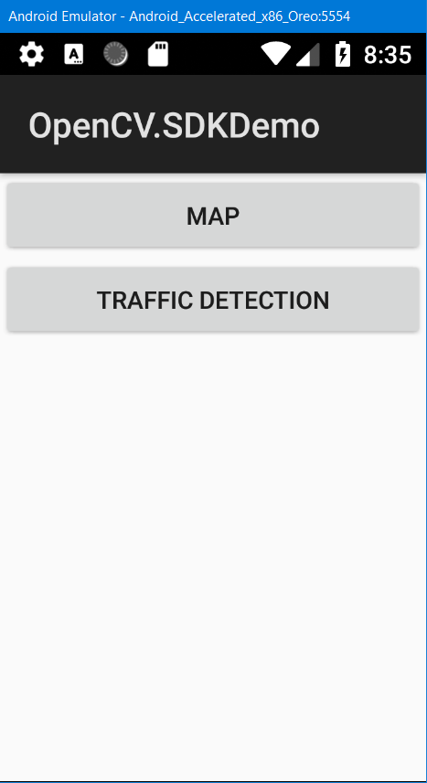
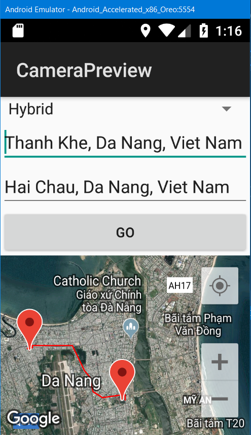
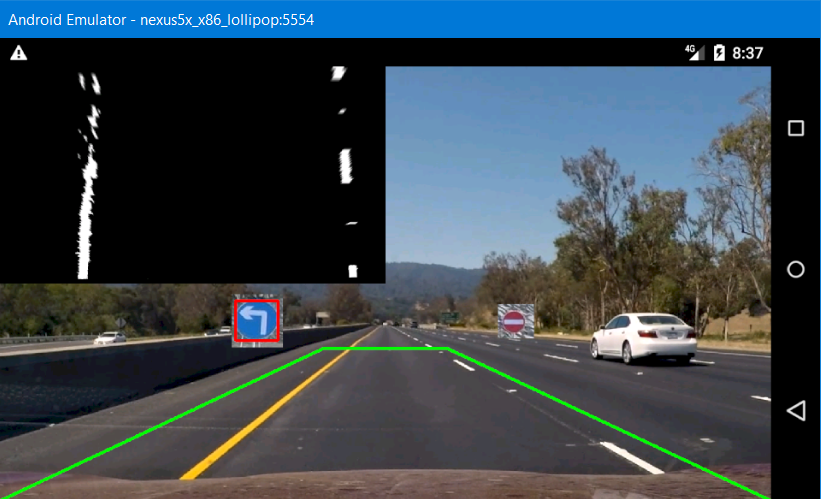

# Driver Assistance

Đồ án môn học Nhập môn ứng dụng di động - SE114.J12

# 1. Công nghệ sử dụng

* Android

* Xamarin C#

* Google Map API

* OpenCV Android

# 2. Các tính năng chính

* Tìm kiếm đường đi giữa 2 địa điểm.

* Phối cảnh làn đường.

* Phát hiện biển báo giao thông.

# 3. Demo

